# PneumoCoach — Edge-AI Breathing Technique Coach

A wearable that coaches breathing technique from a single IMU on the sternum, with an 8-bit neural network running entirely on the ESP32. Includes an honest account of the premise we falsified with our own hardware.

> Breathing retraining is standard care in pulmonary rehabilitation — but the moment the patient goes home, nobody is watching. PneumoCoach is that missing mirror.

---

## Acknowledgements

This project was built by a team of Electronics and Automation Engineering students at **ESPOL — Escuela Superior Politécnica del Litoral**, Guayaquil, Ecuador, under the academic mentorship of **Prof. Briggette Briones Morante** (Faculty of Electrical and Computer Engineering).

Thanks to the MYOSA team at MakeSense EduTech for the hardware and for publishing the Arduino driver sources — reading `AccelAndGyro.cpp` is what told us to clock the IMU from the gyroscope PLL instead of the internal oscillator, a detail that would have quietly corrupted our frequency measurements otherwise.

---

## Overview

Pulmonary rehabilitation teaches patients with COPD and asthma to breathe **diaphragmatically** — abdomen expanding, upper chest still, long pursed-lip exhale. The technique is taught in clinic, then practised at home, twenty minutes a day, unsupervised. Technique drift is common and the patient has no way to notice it happening.

PneumoCoach is a wearable that watches the chest wall and reports, every three seconds, how the patient is breathing relative to their own calibrated reference.

The original design rested on a mechanical hypothesis: that thoracic breathing rotates the upper sternum while diaphragmatic breathing translates it, so the ratio between those two movements would separate them. We wrote that hypothesis down in a falsifiable form, built a tool that tested it against a binary threshold, and then measured it on a real chest.

**It was wrong.** What we built instead — and what the measurements support — is a device that calibrates against each patient at the start of every session and classifies relative to that. The full account is below, because the falsification is the most useful thing in this post.

<p align="center">
  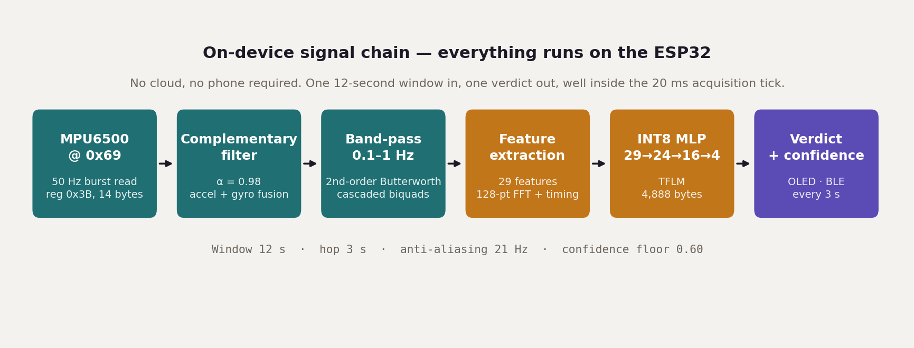<br/>
  <i>The complete signal chain. Everything between the sensor and the verdict runs on the ESP32.</i>
</p>

**Key features:**

* **Per-session calibration** — the patient performs two 30-second reference manoeuvres and the device classifies relative to *their own* axis, because we measured that absolute classification does not hold across sessions
* **Fully on-device inference** — a 5,448-byte INT8 neural network running under TensorFlow Lite for Microcontrollers in 224 µs per window, with no cloud connection and no phone required for the core loop
* **Deterministic 50 Hz acquisition** measured at 50.00 Hz with 0.00 % deviation on real hardware, using a FreeRTOS task pinned to its own core
* **The device refuses to guess** — below a 0.60 confidence floor it shows no verdict rather than risk coaching a patient wrongly
* **Mount-angle calibration** — the enclosure does not have to be aligned to any axis; a two-posture procedure measures the rotation and the DSP compensates for it
* **Companion application** over BLE with live biofeedback, sensor detail, and session progress

---

## Demo / Examples

### **Images**

<p align="center">
  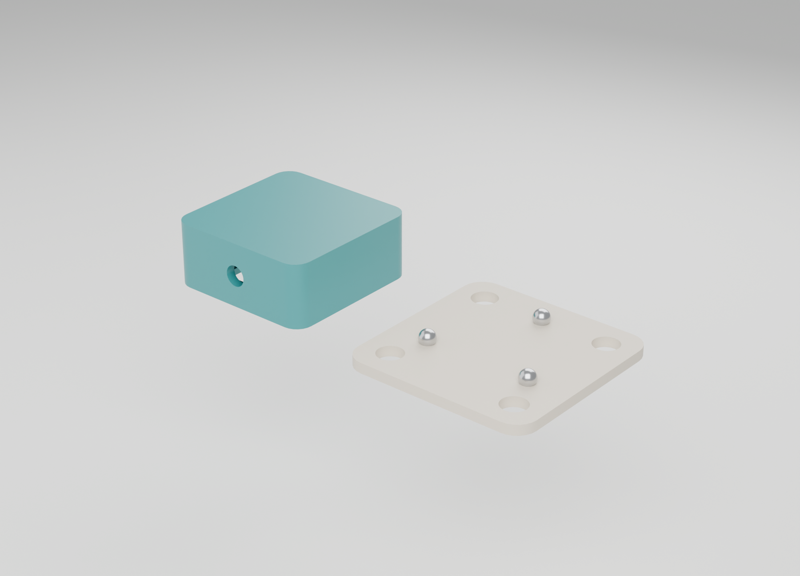<br/>
  <i>The two enclosure variants. Left: the sternal capsule, 37 × 37 × 15.5 mm, carrying only the IMU. Right: the adhesive base plate with four magnet pockets and a three-point kinematic coupling.</i>
</p>

<p align="center">
  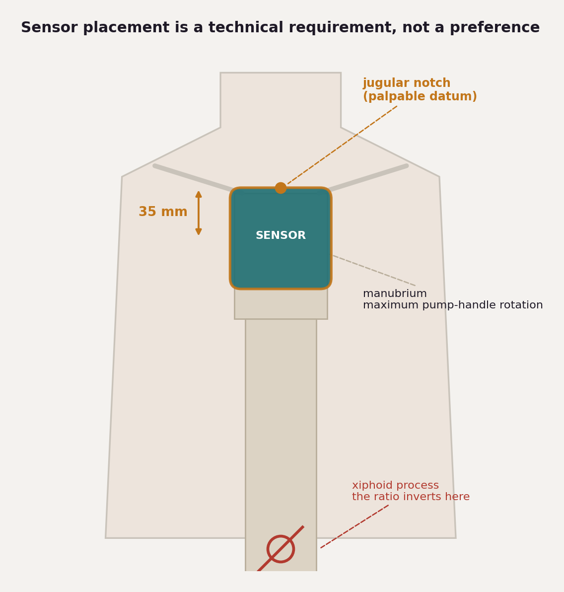<br/>
  <i>Placement is a technical requirement. The sensor centre sits 35 mm below the jugular notch, over the manubrium, where pump-handle rotation is greatest. Over the xiphoid process the ratio inverts and the model reads backwards.</i>
</p>

<p align="center">
  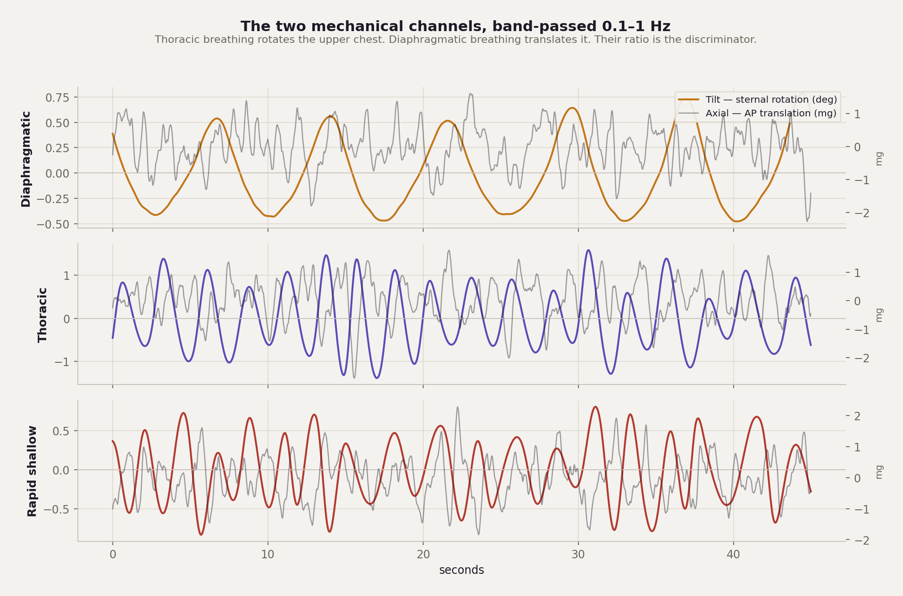<br/>
  <i>The two mechanical channels after band-pass filtering, from the synthetic generator. This is what we predicted. Real recordings diverge from it by 15–16 sigma on the tilt amplitudes, which is how we learned the generator's physics was wrong.</i>
</p>

<p align="center">
  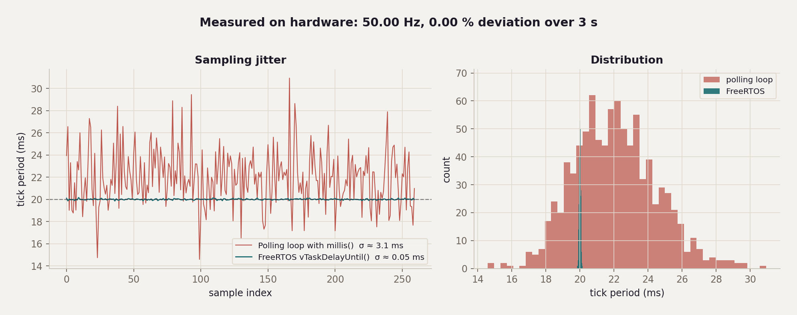<br/>
  <i>Why the acquisition task is pinned to a core with absolute-time scheduling. Timing jitter becomes spectral contamination in exactly the 0.1–1 Hz band we analyse.</i>
</p>

<p align="center">
  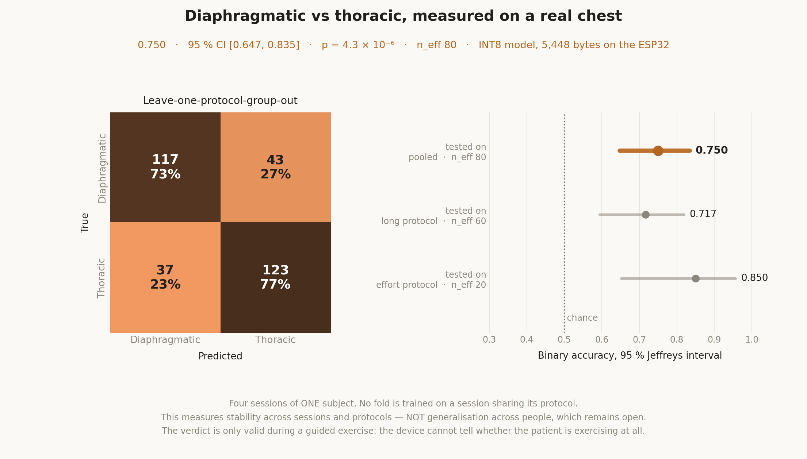<br/>
  <i>The deployed model, on a real chest: diaphragmatic against thoracic, leave-one-protocol-group-out over four sessions of one subject. The footer states the scope, because a figure that travels without it gets cited without it. Regenerate it with tools/figura_resultados.py.</i>
</p>

<p align="center">
  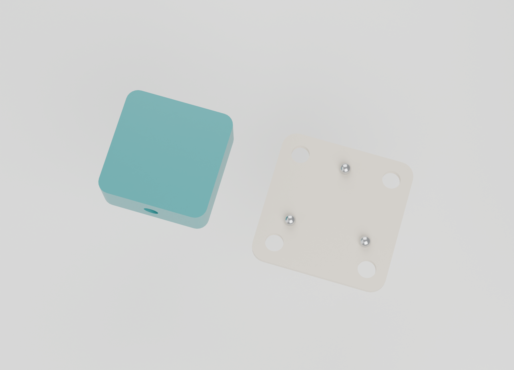<br/>
  <i>Top view of both enclosure variants, showing the cable gland on the capsule and the magnet pocket layout on the base.</i>
</p>


### **Enclosure — CAD Renders**

<p align="center">
  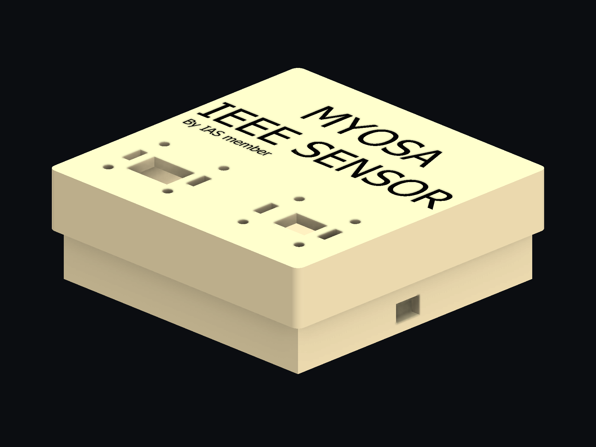<br/>
  <em>Complete enclosure assembly — custom 3D-printable housing for the MYOSA board.</em>
</p>

<p align="center">
  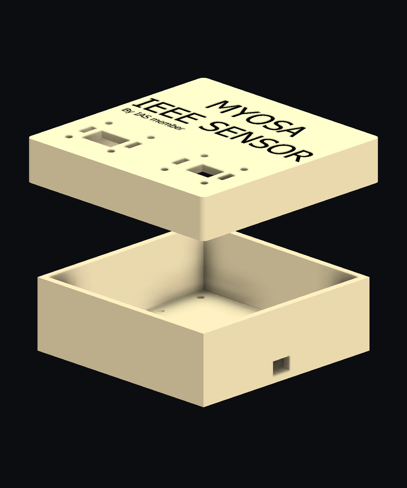<br/>
  <em>Exploded view showing box, lid, and internal layout.</em>
</p>

<table>
  <tr>
    <td align="center">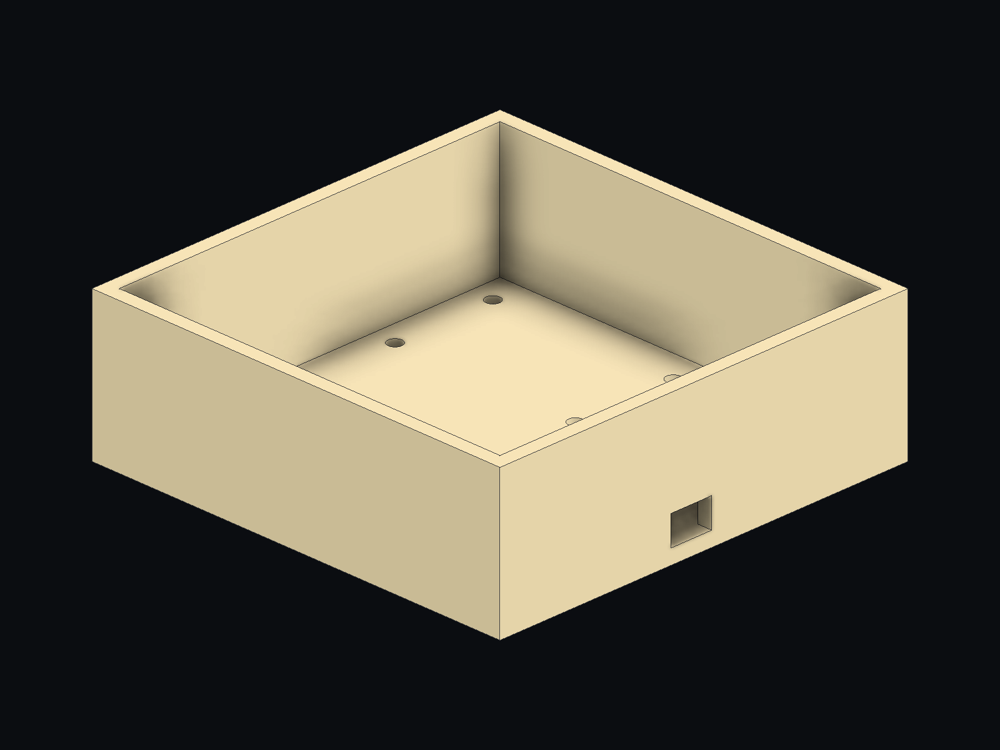<br/><em>Box — isometric</em></td>
    <td align="center">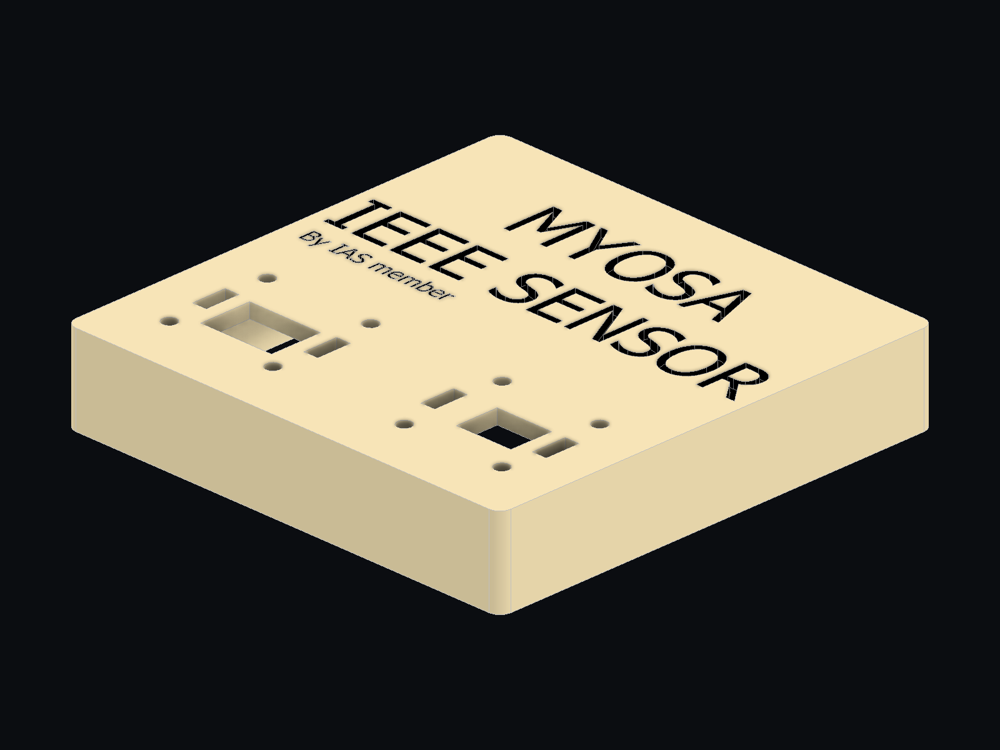<br/><em>Lid — isometric</em></td>
  </tr>
  <tr>
    <td align="center">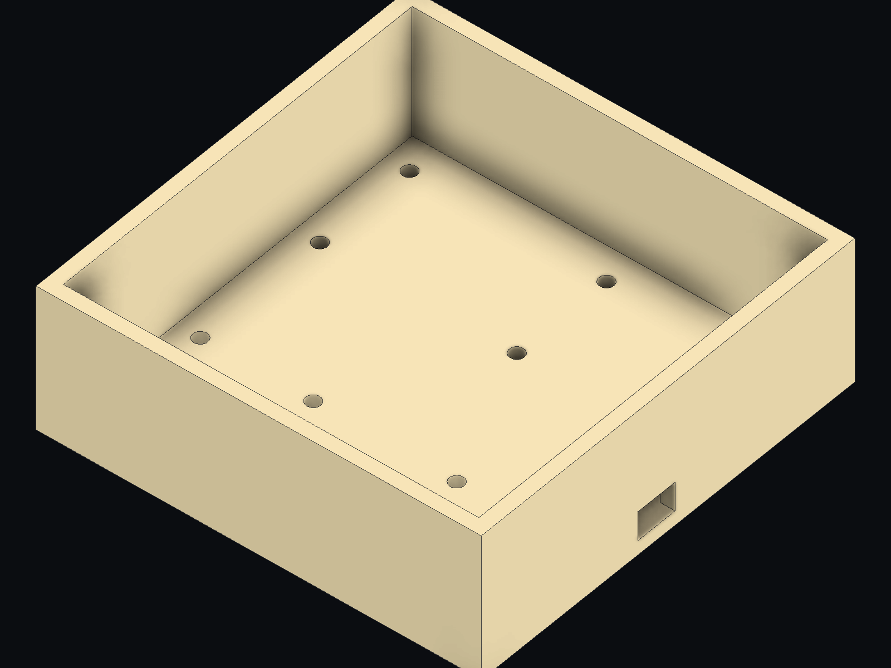<br/><em>Box — internal cavity</em></td>
    <td align="center">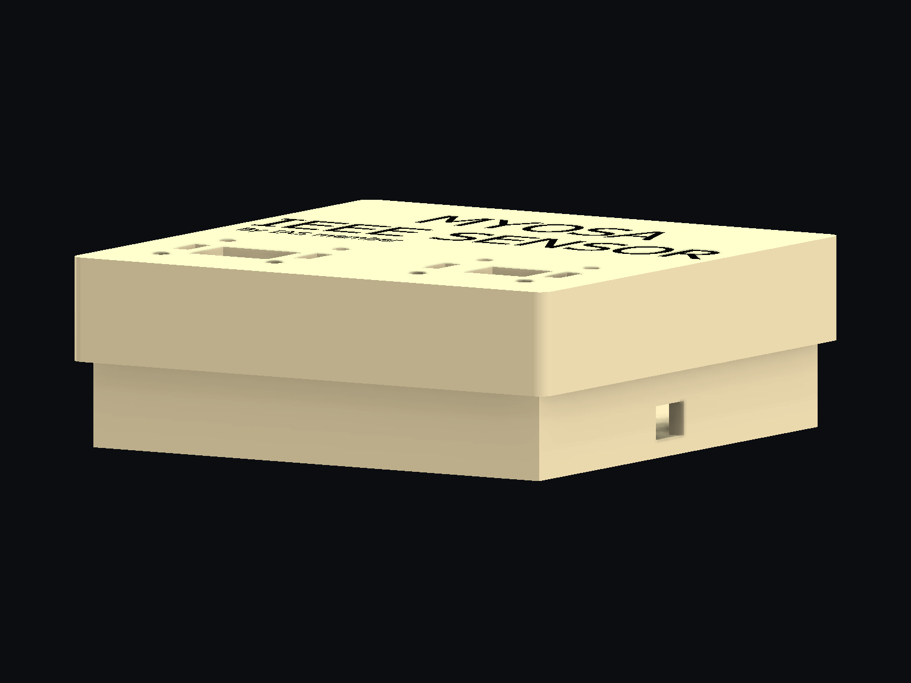<br/><em>Corner detail</em></td>
  </tr>
</table>

### **Videos**

<video controls width="100%">
  <source src="pneumocoach-demo.mp4" type="video/mp4">
</video>

---

## Features (Detailed)

### **1. Separating rotation from translation — and what that separation turned out to mean**

The raw accelerometer signal on the sternum mixes two mechanically different things. The firmware separates them explicitly:

**Tilt channel.** The accelerometer gives an absolute but noisy chest-wall angle; the gyroscope gives a clean angular rate that integrates into drift. A complementary filter (α = 0.98) takes the low frequencies from one and the high frequencies from the other, producing a stable pitch angle.

**Axial channel.** From the Z axis we subtract the gravity projection `g·sin(pitch)`, leaving true antero-posterior translation rather than the tilt we already measured.

Both channels then pass a 2nd-order Butterworth band-pass, 0.1–1 Hz, implemented as cascaded biquads. The lower corner removes gravity and postural drift; the upper corner removes ballistocardiographic and motion content.

A number worth stating plainly, because it drove several design decisions: at 0.15 Hz a 5 mm translation produces about **0.45 mg**, while a 2° rotation produces about **35 mg**. The rotation channel is roughly two orders of magnitude stronger. In-band accelerometer noise is around 0.4 mg, so the axial channel operates near SNR 1 while the tilt channel sits near SNR 100. We expected the model to lean on tilt, with the axial channel contributing mainly through the ratio. On real recordings the opposite held, and in a specific way worth naming: across our four sessions **`tilt_rms` changes the sign of its effect (+1.82, −1.58, −0.76, +1.78) while `axial_rms` does not (+2.19, +1.06, +1.19, +3.44)**. The strong channel is the unstable one. That single fact is what forced per-session calibration, and it is why the axial channel earns its place despite operating near SNR 1. The asymmetry in SNR is physics; our inference from it was not.

Two caveats we would rather state than have you assume. Sign convention here is *d* = (thoracic − diaphragmatic), matching `tools/analizar_captura.py`; `tools/diagnostico_premisa.py` uses the opposite, which is why the same measurement appears in this repository with both signs. And `axial_rms` is **not** the only stable feature — an earlier version of this post said so and that was wrong. Counted rather than remembered: 12 of the 29 keep their sign across four sessions, 14 across the first three. Reproduce with `python tools/medir_cociente.py`.

### **2. Twenty-nine features, then a very small network**

Feeding raw windows to a neural network would need a 600 × 6 input tensor — 14.4 KB before any intermediate activation, on a chip with 520 KB of SRAM shared with FreeRTOS, I²C buffers and the display framebuffer. Instead a DSP front end computes **29 features** per 12-second window:

* Per channel: RMS, peak-to-peak, zero-crossing rate, dominant frequency, spectral purity, centroid, three normalised band powers, spectral entropy
* Cross-channel: `log10(tilt_rms / axial_rms)` — intended as the primary discriminator, later measured at Cohen's d = −0.05 on a real chest — and the zero-lag correlation between channels
* Breath timing: rate, period variability, I:E ratio and its variability, from a hysteresis comparator on the tilt channel
* Artifact detection: high-frequency energy ratio, maximum jerk, gyroscope RMS

The classifier is a 29 → 32 → 16 → 3 multilayer perceptron. Quantised to INT8 it occupies **5,448 bytes** and contains exactly two kinds of operator — `FULLY_CONNECTED` and `SOFTMAX` — so the firmware registers `MicroMutableOpResolver<2>` and the linker discards the rest of the kernel library. On device it runs in **224 µs** per window, using 896 bytes of an 8 KB tensor arena.

Three classes, not the five we started with, and both cuts were measured rather than argued. Training a `motion artifact` class alongside the techniques cost five points on the question that matters (0.694 against 0.750), so artifact rejection moved to the confidence floor instead. A `rest` class scores 0.460 across protocols — below chance — because resting breathing genuinely resembles thoracic breathing at the sternum.

We also train logistic regression and random forest baselines on every run. The random forest actually scores slightly higher than the network. We report that rather than hide it: it suggests the problem is largely piecewise-linear over these features, and a pruned gradient-boosted tree is legitimate future work.

### **3. Deterministic acquisition, and why it matters**

A polling loop built on `millis()` does not give deterministic sampling — its jitter depends on everything else in the loop, and timing jitter in the 0.1–1 Hz band becomes spectral contamination exactly where the respiratory signal lives.

The acquisition task is a FreeRTOS task **pinned to core 1**, waking on absolute instants via `vTaskDelayUntil()` so period error does not accumulate. Core 0 is left for serial, BLE and the display, which is where Espressif's radio stack lives by default. Measured on hardware: **50.00 Hz, 0.00 % deviation** over three seconds, and 49.95 Hz sustained over twenty.

The display is a low-priority task at 5 Hz. It is the heaviest bandwidth consumer on the I²C bus, and if it blocks the IMU read, samples are lost.

### **4. The module is an MPU6500, not an MPU6050**

The MYOSA IMU carrier is silkscreened "MPU-6050", but `WHO_AM_I` returns `0x70` — that is **MPU6500** silicon. This is common in GY-521 clones and it is not cosmetic.

On the MPU6050, `CONFIG.DLPF_CFG` sets the analogue bandwidth for both accelerometer and gyroscope. On the MPU6500 that register only affects the gyroscope; the accelerometer has its own filter in `ACCEL_CONFIG2` (0x1D), a register that does not exist on the 6050. Without writing it, the accelerometer stays at 460 Hz bandwidth. Sampling at 50 Hz — Nyquist 25 Hz — that folds broadband noise directly onto the respiratory signal, and the failure is treacherous: the waveform still looks plausible while the spectrum is contaminated.

The firmware detects `0x68`, `0x70`, `0x71` and `0x73`, configures accordingly, and then **reads the registers back**, because an ACK on the bus does not guarantee the value was written.

### **5. Two calibrations, for two different problems**

**Mount calibration** solves a geometry problem. Our first attempt required the module to be aligned with a sensor axis; on the first real torso, gravity split 0.738 / 0.739 g between two axes — the board sat at 45°, and picking the "dominant axis" resolved a tie by a thousandth. The design changed to measure rather than demand: two postures give two known anatomical directions, Gram-Schmidt builds an orthonormal basis, and the DSP applies the rotation. An uncompensated 45° rotation costs 13 % median error across the features; with calibration it drops to 1.7 %.

**Session calibration** solves a much harder problem, and it is the one that reshaped the project. Sessions of the same subject, same mount, minutes apart, produced features whose *sign* flipped between them — `tilt_rms`, the strongest channel we have, reverses direction from one session to the next.

The question "is this window thoracic in absolute terms?" has no stable answer, because the relationship between technique and sternal mechanics depends on the subject, the mount, and how they execute that day. The question that does have a stable answer is relative: *does this look more like **your** thoracic or **your** diaphragmatic, today?*

So the device now guides two 30-second reference manoeuvres at the start of each session and projects every window onto that axis:

```python
z = (x - ref_dia) / (ref_tor - ref_dia)
```

The patient's diaphragmatic breathing lands at 0 and their thoracic at 1, whatever their build, mount or effort. Measured across four sessions with leave-one-protocol-group-out validation, the calibrated device reaches **0.750** on the binary question against a chance level of 0.500, with the confidence interval clear of chance. The numbers and their limits are in the validation section below.

It costs about forty seconds per session. That is a real cost and we state it rather than hide it — though it is not foreign to clinical practice, where a physiotherapist also observes a patient before correcting them.

### **6. Companion application**

A Next.js and React application connects over BLE and presents three views: a biofeedback dashboard with the current verdict, breathing rate and I:E ratio; a sensor view showing both mechanical channels live plus posture and ambient context from the BMP180; and a progress view with session summary and historical trend.

The application refuses to display a verdict below the confidence floor, mirroring the firmware. A breathing orb paces the patient — and its animation duration is derived from the measured breathing rate, not fixed, because an animation that does not match the patient's own rhythm competes with it instead of guiding it. All motion is disabled under `prefers-reduced-motion`; for someone with dyspnoea, a pulsing interface can be counterproductive.

---

## Usage Instructions

### Flash the acquisition firmware

The capture sketch has **no library dependencies** — only `Wire.h` — so it compiles in a freshly installed Arduino IDE.

```bash
arduino-cli compile --fqbn esp32:esp32:esp32 firmware/arduino/pneumocoach_capture
arduino-cli upload -p COM9 --fqbn esp32:esp32:esp32 firmware/arduino/pneumocoach_capture
```

### Verify the hardware

This scans the I²C bus, confirms the IMU responds, runs a gravity self-test and measures the real sampling rate:

```bash
python tools/capture.py --puerto COM9 --verificar
```

Expected output:

```plaintext
#   0x69  MPU6050 (esperado)
# IMU detectada: MPU6500/9250 (WHO_AM_I 0x70)
# verificacion: SMPLRT=19 CONFIG=4 GYRO=0 ACCEL=0
# ACCEL_CONFIG2=4 (anti-aliasing del acelerometro)
# autoprueba: |accel| = 1.063 g sobre 50 muestras
   149 muestras en 2.96 s  ->  50.00 Hz   desviacion 0.00 %
```

### Calibrate the mount

Two postures, six seconds each. The rotation matrix is saved and used automatically by every subsequent capture.

```bash
python tools/orientacion.py --puerto COM9 --sujeto s01
```

### Record a labelled session

A nine-block timed protocol, about thirteen minutes. The tool dictates what to breathe and writes the labels itself — filenames and metadata are derived, never typed.

```bash
python tools/capture.py --puerto COM9 --sujeto s01 --protocolo
```

### Analyse

Runs the recording through the same DSP the device uses, plots the filtered channels, and reports whether the mechanical premise holds on real data.

```bash
python tools/analizar_captura.py data/raw/s01_protocolo_*.csv
```

### Train and deploy the model

```bash
python scripts/train.py --subjects 60
python scripts/emit_c_artifacts.py
```

The second command regenerates the C headers the firmware compiles against — the shared constants, the INT8 flatbuffer, and the golden parity vectors.

```python
# The single source of truth. If a number appears in both Python and C,
# it lives here and the C side is generated from it.
FS_HZ = 50.0
WINDOW_N = 600          # 12 s
HOP_N = 150             # verdict every 3 s
BP_LOW_HZ, BP_HIGH_HZ = 0.10, 1.00
CONFIDENCE_FLOOR = 0.60
```

### Run the companion application

```bash
cd companion && npm install && npm run dev
```

---

## Tech Stack

* **ESP32-WROOM-32E** — dual-core Xtensa LX6, FreeRTOS, acquisition pinned to core 1
* **MPU6500** (MYOSA IMU carrier, I²C `0x69`) — chest-wall motion, ±2 g / ±250 dps
* **SSD1306 OLED**, **APDS9960**, **BMP180** — biofeedback, touchless control, postural context
* **TensorFlow Lite for Microcontrollers** — INT8 inference, `MicroMutableOpResolver<2>`
* **TensorFlow / Keras** — training and full-integer post-training quantisation
* **NumPy · SciPy · scikit-learn** — synthetic physics, DSP reference, baselines
* **Arduino-ESP32 3.3.11** (based on ESP-IDF 5.5.5) — firmware toolchain
* **Next.js 16 · React 19 · Tailwind CSS 4 · shadcn/ui** — companion application
* **Blender 5.1** — parametric enclosure model, driven headless from a command-line tool
* **pytest** — 22 tests guarding the Python/C contract

---

## Requirements / Installation

```bash
pip install numpy scipy scikit-learn tensorflow pytest pyserial matplotlib openpyxl reportlab
```

```bash
npm --prefix companion install
```

Firmware toolchain:

```bash
arduino-cli config add board_manager.additional_urls https://espressif.github.io/arduino-esp32/package_esp32_index.json
arduino-cli core install esp32:esp32
```

Run the test suite before touching anything:

```bash
pytest
```

---

## File Structure

```
/pneumocoach
  ├─ ml/
  │   ├─ pneumocoach/
  │   │   ├─ config.py          single source of truth for Python and C
  │   │   ├─ synth.py           physics-based synthetic IMU recordings
  │   │   ├─ dsp.py             reference DSP chain, mirrors the C port
  │   │   ├─ dataset.py         windowing and subject-wise splits
  │   │   └─ train.py           training, baselines, INT8 quantisation
  │   ├─ scripts/
  │   │   ├─ train.py
  │   │   └─ emit_c_artifacts.py
  │   └─ tests/                 22 contract tests
  ├─ firmware/
  │   ├─ arduino/pneumocoach_capture/
  │   │   └─ pneumocoach_capture.ino
  │   ├─ include/               GENERATED — do not edit by hand
  │   └─ respaldo/              factory firmware backup
  ├─ tools/
  │   ├─ capture.py             labelled session recorder
  │   ├─ orientacion.py         mount calibration
  │   ├─ analizar_captura.py    DSP analysis and premise check
  │   └─ carcasa.py             parametric enclosure: dimensions, STL, renders
  ├─ companion/                 Next.js companion application
  ├─ docs/adr/                  architecture decision records
  └─ blog/
      ├─ pneumocoach.md
      └─ assets/
```

---

## What is validated, and what is not

We would rather state this plainly than have a reader discover it. Several
claims in earlier drafts of this post were wrong, and the hardware is what
proved them wrong.

**Measured on hardware:** the 50.00 Hz sampling rate with 0.00 % deviation, the
MPU6500 identification and register configuration, the 1.063 g accelerometer
scale error, the ~1 dps gyroscope bias, the 45° and 77° mount rotations and
their calibration, and the flash and RAM footprints.

**Measured on a real chest, across four sessions of one subject.** The question
is binary: given a window that is diaphragmatic or thoracic, does the model pick
the right one?

| Tested on | Binary accuracy | 95 % CI | n effective |
|---|---|---|---|
| Long protocol | 0.717 | [0.594, 0.819] | 60 |
| Effort protocol | 0.850 | [0.651, 0.956] | 20 |
| **Pooled** | **0.750** | **[0.647, 0.835]** | **80** |
| Chance | 0.500 | — | — |

**0.750, and this time it is significant** — p = 4.3 × 10⁻⁶, with the confidence
interval clear of chance. Reproduce it with `python ml/scripts/entrenar_real.py`.

Two things about how that was validated, because they are why we trust it and
why our earlier figures were wrong.

**We split by protocol group, not by session.** Two of our sessions share a
recording protocol and sit at a feature-space distance of 0.87 from each other,
against 1.58–1.73 to the others. Training on one and testing on its near-twin
measures similarity, not generalisation — and it inflated our numbers twice
before we caught it. No fold is trained on a session sharing its protocol.

**The interval is computed over the effective n.** Windows overlap by 75 %, so
320 test windows are roughly 80 independent observations. Reporting an interval
over the nominal count would make thin evidence look strong.

**Retracted:** two figures from earlier versions of this post. The 89.7 % came
from a synthetic generator whose physics we later measured to be wrong — real
recordings diverge from it by 15–16 σ on the tilt amplitude features; training
accuracy against your own simulation is not evidence. The 0.606 was correct when
written but was measured before the fourth session and before we switched to
leave-one-protocol-group-out; it is superseded, not retracted for being wrong.

**Not demonstrated:** generalisation across people. Four sessions of one subject
measure stability across sessions and protocols. They say nothing about other
bodies, and that remains the open question.

**Also measured, and worth stating:** the device cannot tell whether the patient
is exercising at all. A classifier asked to separate resting breathing from a
deliberate manoeuvre scores 0.460 across protocols — below chance. Resting
breathing genuinely resembles thoracic breathing at the sternum. The verdict is
only valid during a guided exercise, and the session is designed around that.

### The premise we falsified

The original design rested on a ratio: thoracic breathing rotates the upper
sternum, diaphragmatic breathing translates it, so `log10(tilt/axial)` should
separate them. In simulation it gave Cohen's d ≈ 3.2.

On the first real chest it gave **d = −0.05**. No separation at all.

The reason turned out to be instructive. Both channels *do* separate strongly on
that session — |d| = 1.8 for tilt, 2.2 for axial — but they move together, so
dividing one by the other cancels the separation. We had assumed diaphragmatic
breathing would be translation-dominant at the sternum. It is not: diaphragmatic
breathing barely moves the upper sternum in *any* direction, because that is
precisely where the diaphragm does not act.

Measuring all four sessions later made the failure sharper than "it does not
separate". Sign convention is *d* = (thoracic − diaphragmatic), so the design
premise predicted a **positive** ratio. What we measure is negative every time:

| Session | Windows/class | Independent | *d* of the ratio |
|---|---|---|---|
| s1 long protocol | 74 | 18 | −0.05 |
| s2 effort | 34 | 8 | −7.56 |
| s3 effort | 34 | 8 | −5.29 |
| s4 long protocol | 74 | 18 | −1.42 |

So the ratio is not merely weak — it points the wrong way in all four sessions,
and its magnitude spans two orders of magnitude between them. Those figures are
computed on **non-overlapping windows**, because consecutive windows share 75 %
of their samples; the overlapped values differ by less than 0.4, which tells us
the effect is not an artefact of overlap. It does not make the two effort
sessions large, though: eight independent windows per class is a point estimate,
not a confident one. Reproduce with `python tools/medir_cociente.py`.
Obvious in hindsight, and we did not see it in advance.

### The problem underneath

A second session thirty minutes later, same subject, same mount, same
calibration matrix, produced the **opposite** relationship: now diaphragmatic
rotated more than thoracic.

The subject then reported that during the "exaggerated diaphragmatic" block he
had exaggerated lifting the sternum. The data confirms it — that block shows
6.86° of sternal rotation, 2.8× his own thoracic breathing, and a classifier
trained on the first session labels it thoracic with 84 % confidence.

Lifting the sternum *is* thoracic mechanics. The sensor measured correctly; the
label was wrong.

That is the real finding, and it is not a sensor problem or a model problem.
**An untrained subject told to "breathe diaphragmatically" produces whatever
they believe that means**, and it changes with the wording of the instruction.
We were labelling intention, not mechanics.

He only caught his own error because he was also the engineer analysing the
data. In a twenty-person study nobody would notice, and twenty quietly wrong
labels are worse than no labels at all.

### What that changed

Data collection is now blocked on an independent ground truth — a second
accelerometer on the abdomen for labelling only, or clinical supervision — and
the device design moved from absolute classification to per-session calibration,
which is what the measurements support.

## License

MIT for source code. Hardware designs are released under CERN-OHL-P v2.

---

## Contribution Notes

The most useful contribution is **real recordings from chests that are not ours**. Four engineering students are not a cohort, and the synthetic-to-real transfer gap is the dominant risk in this project. The recording protocol in `tools/capture.py` is reproducible and self-labelling; if you have a MYOSA kit, a session takes thirteen minutes.

If you change anything under `ml/pneumocoach/`, run `pytest` and then `python scripts/emit_c_artifacts.py`. The files under `firmware/include/` are generated and carry a `GENERATED FILE — DO NOT EDIT` banner. Editing them by hand is destroyed on the next build and, in the meantime, makes the firmware disagree with the model it is executing.
