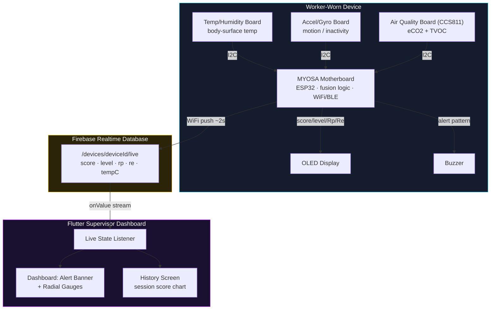
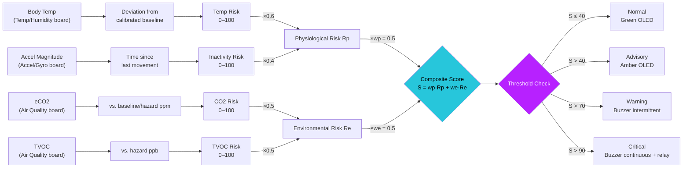
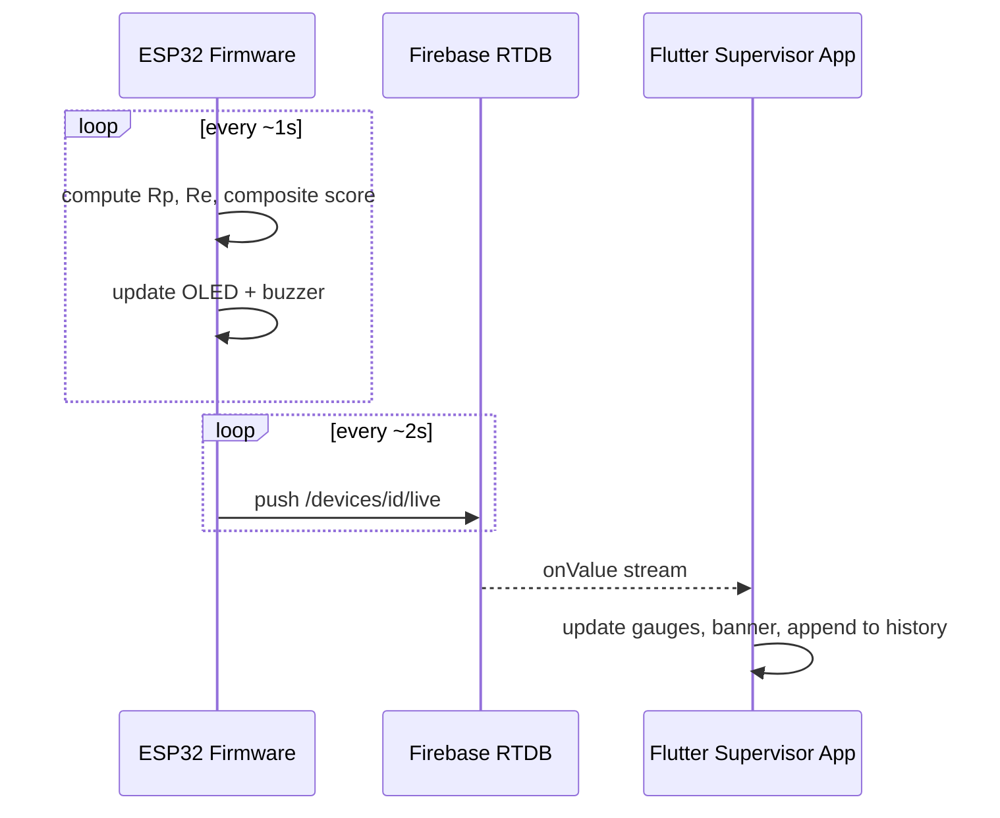
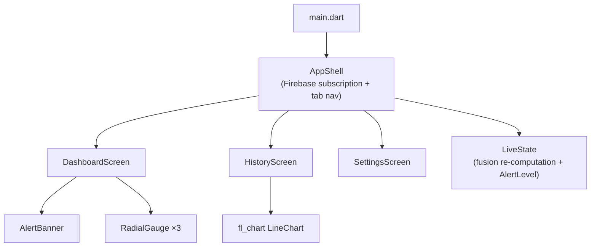

> Real-time, dual-channel hazard detection for confined-space workers — fusing body and environment into one safety score, built entirely on the MYOSA Mini platform.

<p align="center">
  
  
  
  
  
  
</p>

---

## Acknowledgements

Built by **Mahmoud Bakrei and Mahmoud Taymour**, Department of Electronics & Communication Engineering, Egypt-Japan University of Science and Technology (E-JUST), supervised by **Dr. Sameh Sherif**, for **IEEE MYOSA 6.0**.

Thanks to the IEEE EMBS E-JUST Student Branch Chapter and the MYOSA organizing team for the platform and the opportunity to build and demo this project.

Full source: [[github.com/IEEE-EMBS-E-JUST-SBC/IEEE-MYOSA-6.0-Smart-Wearable-for-Hazardous-Confined-Space-Workers](https://github.com/IEEE-EMBS-E-JUST-SBC/IEEE-MYOSA-6.0-Smart-Wearable-for-Hazardous-Confined-Space-Workers)]

---

## Overview

Confined-space work — underground utility tunnels, chemical storage tanks, mining shafts, industrial vessels — exposes workers to **two interacting classes of risk at once**: physiological deterioration (heat stress, fatigue, loss of consciousness) and environmental degradation (toxic gas accumulation, oxygen depletion). Most existing safety systems monitor only one of these channels — a physiological wearable *or* a fixed gas detector — never both from a single body-worn device. That gap matters because the two risks compound each other: a worker already suffering early heat stress is less able to notice or react to deteriorating air quality, and slowly accumulating toxic gas accelerates physiological decline through reduced oxygen availability. A single-channel system structurally cannot catch this compound failure mode until it has already become critical.

**ConfinedGuard** closes that gap. It's a wearable built entirely on the **MYOSA Mini platform** that continuously fuses body-surface temperature, motion/inactivity, and air-quality (eCO2 + TVOC) readings into one **composite risk score**, drives a three-tier local alert (Advisory / Warning / Critical), and streams live state to a **supervisor-facing Flutter dashboard** over Firebase.

**Who it's for:** workers entering confined or hazardous spaces — underground utilities, chemical storage, mining, industrial maintenance — and the supervisors responsible for monitoring them from outside the space.

### At a Glance

| | |
|---|---|
| **Platform** | MYOSA Mini (motherboard + Temp/Humidity board + Accel/Gyro board + Air Quality (CCS811) board + OLED + buzzer) |
| **Fusion cycle** | ~1s sensor fusion tick, 2s Firebase push |
| **Composite score** | `S = wp·Rp + we·Re` (wp = we = 0.5) |
| **Alert tiers** | Normal ≤40 · Advisory >40 · Warning >70 · Critical >90 |
| **Physiological (Rp)** | Temp deviation from calibrated baseline (60%) + inactivity duration (40%) |
| **Environmental (Re)** | eCO2 vs. baseline/hazard ppm (50%) + TVOC vs. hazard ppb (50%) |
| **Connectivity** | WiFi → Firebase Realtime Database → Flutter supervisor app (BLE relay for extended range) |
| **Alerting** | OLED + buzzer (device) · animated pulsing banner + gauges (app) |

**Key features:**
* Dual-channel risk fusion — physiological and environmental hazards monitored simultaneously from one wearable, not two disconnected systems
* Composite risk scoring with a three-tier alert hierarchy: **Advisory (>40)**, **Warning (>70)**, **Critical (>90)**
* On-device power-on calibration — a 15-second still baseline capture for body temperature before monitoring begins
* Local alerting via OLED (live score + Rp/Re breakdown) and buzzer (intermittent for Warning, continuous for Critical)
* Live supervisor-facing **Flutter dashboard** with an animated pulsing alert banner, radial gauges for score/Rp/Re, and a session history chart
* Firebase Realtime Database as the live bridge between the wearable and the supervisor's phone/tablet — no BLE pairing required
* Traceable risk sources — physiological and environmental channels are kept separate through fusion so an elevated score can always be attributed to its origin
* IP54-rated rugged enclosure concept + BLE relay bridge for extended range in attenuating underground/industrial environments

### System Architecture



### Dual-Channel Risk Fusion Pipeline



<details>
<summary><b>▶ Click to expand: alert threshold mapping (Table 1)</b></summary>

| Alert Level | Score Range | Actuation Response |
|---|---|---|
| Normal | S ≤ 40 | Green OLED status |
| Advisory | S > 40 | Amber OLED, notice logged |
| Warning | S > 70 | Buzzer (intermittent) + OLED + live push |
| Critical | S > 90 | Continuous buzzer + BLE relay to supervisor |

</details>

---

## Demo / Examples

### Images

<p align="center">
  <br/>
</p>

### Videos

**🎥 Project Presentation & Testing**
<div class="youtube-embed">
  <iframe src="https://www.youtube.com/embed/LsYkkQLzqwE"></iframe>
</div>


---

## Features (Detailed)

### 1. Dual-Channel Sensing (Physiological + Environmental)

Three MYOSA sensor boards feed the fusion algorithm every ~1 second:

- **Temperature/Humidity board** — body-surface temperature, compared against a per-session calibrated baseline
- **Accelerometer/Gyroscope board** — motion magnitude, used to detect prolonged inactivity (a proxy for possible loss of consciousness)
- **Air Quality board (CCS811)** — eCO2 and TVOC concentration, the environmental hazard signal

### 2. Power-On Baseline Calibration

On boot, the worker holds still for **15 seconds** while the firmware averages body temperature readings into `tempBaselineC`. All subsequent temperature-risk calculations measure *deviation from this personal baseline* rather than a fixed population average — so a worker who naturally runs warm doesn't get false Advisory alerts.

```cpp
// Baseline temperature calibration — worker should be still,
// unexposed to heat sources, for CALIBRATION_MS (15s default)
float sum = 0.0f;
int count = 0;
unsigned long calStart = millis();
while (millis() - calStart < CALIBRATION_MS) {
  if (myosa.Th.ping()) {
    sum += myosa.Th.getTempC();
    count++;
  }
  delay(200);
}
if (count > 0) tempBaselineC = sum / count;
```

### 3. Physiological Risk Channel (Rp)

Combines two sub-signals with fixed weights:

```cpp
float computePhysioRisk() {
  float tempRisk = 0.0f;
  float inactivityRisk = 0.0f;

  if (myosa.Th.ping()) {
    float tC = myosa.Th.getTempC();
    float deviation = tC - tempBaselineC;
    if (deviation < 0) deviation = 0;  // only rising temp counts as heat-stress risk
    tempRisk = constrain((deviation / TEMP_DEVIATION_MAX) * 100.0f, 0.0f, 100.0f);
  }

  if (myosa.Ag.ping()) {
    float mag = sqrtf(ax*ax + ay*ay + az*az);
    float delta = fabsf(mag - lastAccelMag);
    if (delta > ACCEL_STILL_THRESHOLD) lastMoveTime = millis();
    unsigned long stillFor = millis() - lastMoveTime;
    inactivityRisk = constrain(((float)stillFor / INACTIVITY_MAX_MS) * 100.0f, 0.0f, 100.0f);
  }

  return (TEMP_SUBWEIGHT * tempRisk) + (INACTIVITY_SUBWEIGHT * inactivityRisk);
}
```

`TEMP_SUBWEIGHT = 0.6`, `INACTIVITY_SUBWEIGHT = 0.4` — heat stress is weighted higher since it's the faster-developing physiological threat in most confined-space scenarios.

### 4. Environmental Risk Channel (Re)

```cpp
float computeEnvironRisk() {
  float co2Risk = 0.0f, tvocRisk = 0.0f;
  if (myosa.Aq.ping() && myosa.Aq.isDataAvailable()) {
    if (myosa.Aq.readAlgorithmResults() == SENSOR_SUCCESS) {
      float co2 = myosa.Aq.getCO2();
      float tvoc = myosa.Aq.getTVOC();
      co2Risk  = constrain(((co2 - CO2_BASELINE_PPM) / (CO2_HAZARD_PPM - CO2_BASELINE_PPM)) * 100.0f, 0.0f, 100.0f);
      tvocRisk = constrain((tvoc / TVOC_HAZARD_PPB) * 100.0f, 0.0f, 100.0f);
    }
  }
  return (CO2_SUBWEIGHT * co2Risk) + (TVOC_SUBWEIGHT * tvocRisk);
}
```

CO2 is normalized between an outdoor-ambient baseline (400 ppm) and a hazard ceiling (5000 ppm); TVOC is normalized directly against a 2000 ppb hazard ceiling.

### 5. Composite Score & Local Alerting

```
S = wp · Rp + we · Re      (wp = we = 0.5)
```

The OLED shows the live tier name plus the numeric score and Rp/Re breakdown, so the channel driving an elevated score stays visible at a glance:

```cpp
void updateOled(float score, AlertLevel level, float rp, float re) {
  // ... shows "NORMAL"/"ADVISORY"/"WARNING"/"CRITICAL" as the title,
  // then "Score: X.X" and "Rp: X.X Re: X.X" below
}
```

| Level | Buzzer Behavior |
|---|---|
| Normal / Advisory | Silent |
| Warning | Toggles every 500 ms (intermittent) |
| Critical | Continuous tone |

### 6. Firebase Realtime Database as the Live Bridge

The firmware pushes the full computed state to `/devices/<deviceId>/live` every 2 seconds — no BLE phone pairing required, since both the wearable and the Flutter app are independent Firebase clients:

```json
{
  "score": 46.2,
  "level": "ADVISORY",
  "rp": 58.0,
  "re": 34.4,
  "tempC": 37.1,
  "updatedAtMs": 812340
}
```



### 7. Flutter Supervisor Dashboard

The companion app (Flutter + `firebase_database` + `fl_chart`) gives a supervisor outside the confined space a live, at-a-glance view:

- **Animated pulsing alert banner** — pulses gently for Warning, urgently (faster, brighter) for Critical, mirroring the buzzer's own behavior
- **Radial gauges** for composite score, Physiological Rp, and Environmental Re, animated smoothly between updates
- **Info tiles** for body temperature, device uptime, and time since last received reading
- **Session history chart** (line chart with threshold reference lines at 40/70/90) and a scrollable recent-readings list
- **Settings tab** documenting the exact scoring formula and thresholds, plus device ID configuration for pairing the app to a specific wearable

<details>
<summary><b>▶ Click to expand: Flutter app module map</b></summary>



Note: the app re-derives the composite score client-side from raw fields (`live_state.dart`'s `_FusionConfig`) using the *same* weights and thresholds as the firmware, so the displayed score always matches what the OLED would show — even as the app iterates independently of the firmware.

</details>

### 8. Rugged Enclosure & Extended-Range Communication

An **IP54-rated enclosure** protects the motherboard and sensor boards from dust and splashing, appropriate for underground and industrial environments. A **BLE relay bridge** node extends effective range between the wearable and a supervisor terminal positioned outside the confined space, where direct BLE range would otherwise be insufficient.

---

## Usage Instructions

### 1. Flash the Firmware

Open `Confined.ino` (or `ConfinedGuard.ino`) in the Arduino IDE with the MYOSA library and ESP32 board package installed, then set your own WiFi and Firebase credentials before flashing:

```cpp
#define WIFI_SSID          "YOUR_WIFI_SSID"
#define WIFI_PASSWORD      "YOUR_WIFI_PASSWORD"
#define FIREBASE_HOST      "https://YOUR_PROJECT-default-rtdb.firebaseio.com/"
#define FIREBASE_AUTH_TOKEN "YOUR_FIREBASE_DATABASE_SECRET"
#define DEVICE_ID          "confinedguard-01"
```

> ⚠️ **Security note:** never commit real WiFi passwords or Firebase database secrets to a public repository or blog submission. Treat the database secret as a password — generate it from **Firebase Console → Project Settings → Service Accounts / Database Secrets**, and rotate it immediately if it's ever been shared or committed in plaintext. The open read/write rules on `/devices/$id/live` used during prototyping should be tightened to require matching auth before any real deployment.

Required libraries: the `myosa` library (from the full MYOSA kit installation, including `myosa.h`, `myosa.cpp`, and the Vera Mono font headers) plus `FirebaseESP32` (Arduino Library Manager).

### 2. Set Up the Flutter App

```bash
flutter pub get
flutterfire configure   # generates YOUR real firebase_options.dart — do not reuse the sample one
flutter run
```

Make sure the `deviceId` passed into `AppShell` in `main.dart` matches the `DEVICE_ID` set in the firmware:

```dart
home: const AppShell(initialDeviceId: 'confinedguard-01'),
```

The Device ID can also be changed at runtime from the app's **Settings** tab without reflashing.

### 3. Calibrate at Power-On

On boot, keep the wearable still and away from heat sources for the 15-second calibration window shown on the OLED (`Calibrating...`). This captures the personal temperature baseline used for all subsequent physiological risk calculations.

### 4. Tune Fusion Weights & Thresholds (Optional)

All weights and thresholds are firmware constants and can be re-tuned for a specific deployment without touching the app (the app mirrors the same formula for its own gauge display):

```cpp
float wp = 0.5f;   // physiological channel weight
float we = 0.5f;   // environmental channel weight
const float ADVISORY_THRESHOLD = 40.0f;
const float WARNING_THRESHOLD  = 70.0f;
const float CRITICAL_THRESHOLD = 90.0f;
```

<details>
<summary><b>▶ Click to expand: full setup checklist</b></summary>

- [ ] Rotate/replace the Firebase database secret before flashing (never reuse the one from this repo)
- [ ] Tighten Firebase RTDB rules on `/devices/$id/live` before any real deployment
- [ ] Flash `Confined.ino` with your own WiFi + Firebase credentials
- [ ] Confirm `DEVICE_ID` in firmware matches `deviceId` in `main.dart` (or set it live via Settings)
- [ ] Run `flutterfire configure` to generate your own `firebase_options.dart`
- [ ] Assemble MYOSA motherboard + Temp/Humidity board + Accel/Gyro board + Air Quality board + OLED + buzzer
- [ ] Power on, complete the 15s calibration hold, verify OLED shows `NORMAL`
- [ ] Confirm the Flutter dashboard shows `Live` connection status and matching score/Rp/Re

</details>

---

## Tech Stack

* **MYOSA Mini Platform** — motherboard, Temperature/Humidity board, Accelerometer/Gyroscope board, Air Quality board (CCS811), OLED display, buzzer, BLE
* **C++ / Arduino Framework** — ESP32 firmware (`myosa.h`/`myosa.cpp` driver, `WiFi`, `FirebaseESP32`)
* **Firebase Realtime Database** — live composite-score streaming to the supervisor app
* **Flutter / Dart** — cross-platform supervisor dashboard
* **fl_chart** — session history line charting with threshold reference lines
* **BLE relay bridge** — extended-range alert delivery in attenuating confined environments
* **IP54-rated enclosure** — dust/splash protection for industrial and underground deployment

---

## Requirements / Installation

**Firmware (Arduino IDE):**

```plaintext
Board: MYOSA / ESP32
Libraries: myosa (full MYOSA kit install), WiFi, FirebaseESP32
```

**Flutter app:**

```bash
flutter pub get
```

Key packages used: `firebase_core`, `firebase_database`, `fl_chart`.

---

## File Structure (Optional)

```
/ConfinedGuard
  ├─ confinedguard.md
  ├─ cover.jpg
  ├─ (project images...)
  ├─ confinedguard-presentation-and-testing.mp4
  ├─ confinedguard-backstage.mp4
  │
  ├─ firmware/
  │   └─ Confined.ino
  │
  ├─ flutter_app/
  │   ├─ main.dart
  │   ├─ firebase_options.dart          # regenerate with your own `flutterfire configure`
  │   ├─ app_shell.dart
  │   ├─ app_theme.dart
  │   ├─ live_state.dart
  │   ├─ dashboard_screen.dart
  │   ├─ history_screen.dart
  │   ├─ settings_screen.dart
  │   └─ widgets/
  │       ├─ alert_banner.dart
  │       └─ radial_gauge.dart
  │
  └─ hardware/
      └─ (enclosure design files, if applicable)
```
