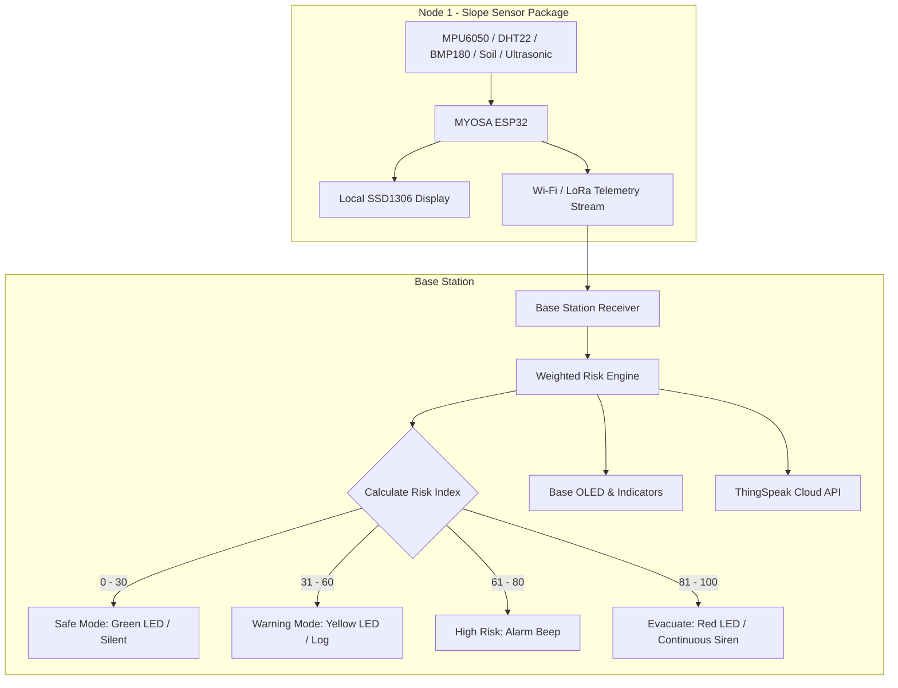

> A low-cost, multi-node IoT early-warning system that watches a slope so people don't have to.

---

## Acknowledgements

Developed under the **MYOSA ecosystem framework** to provide an open-source, affordable disaster-management tool for early landslide detection in vulnerable hilly and slope-prone regions.

---

## Overview

Landslides are sudden, high-consequence geological hazards that demand continuous, real-time field observation rather than periodic manual inspection. **PREVAIL-LS** addresses this gap with a distributed sensor-node network that continuously measures ground tilt, soil moisture, crack/surface displacement, and ambient environmental conditions on a slope, fuses them into a single weighted risk score, and escalates alerts locally (LED/buzzer) and remotely (cloud dashboard) as conditions worsen.

**Key features:**

* Multi-sensor fusion across tilt, moisture, displacement, pressure, and humidity
* Weighted Risk Engine producing a single 0–100 slope-stability score
* Four-tier alerting: **SAFE → WARNING → HIGH RISK → EVACUATE**
* Wi-Fi telemetry link between the field sensor node and the Base Station
* Live cloud dashboard via ThingSpeak (charts + real-time indicator widgets)
* Modular, multi-node-ready architecture (`NODE_01`, `NODE_02`, …) for scaling across a slope

---

## Demo / Examples

### Images

#### Physical Prototype

<p align="center">
  <br/>
  <i>Figure 1 — PREVAIL-LS Multi-Node Prototype: physical landslide-slope simulation terrain showing Node 1 and Node 2 positioned across critical monitoring regions.</i>
</p>

<br/>

#### Hardware Architecture — Node 1

<p align="center">
  <br/>
  <i>Figure 2 — Node 1 Hardware Assembly: close-up view of the sensors (MPU6050, DHT22, BMP180, Ultrasonic), MYOSA ESP32 board, and interface circuitry mounted at the field node.</i>
</p>

<br/>

#### System Demonstration & Testing

<p align="center">
  <br/>
  <i>Figure 3 — PREVAIL-LS Complete Demonstration Setup: integrated view showing the slope terrain model, active monitoring nodes, Base Station, indicator lights, and telemetry outputs.</i>
</p>

<br/>

#### Live Cloud Dashboard (ThingSpeak)

<p align="center">
  <br/>
  <i>Figure 4 — PREVAIL-LS Risk Status and System Status widgets, alongside live Soil Moisture and Humidity readouts.</i>
</p>

<br/>

<p align="center">
  <br/>
  <i>Figure 5 — Current Vibration, Current Pressure, and Current Distance indicator widgets with the Soil Moisture trend chart.</i>
</p>

<br/>

<p align="center">
  <br/>
  <i>Figure 6 — Field charts for Humidity, Atmospheric Pressure, Ground Vibration, and Slope Movement/Distance over time.</i>
</p>

<br/>

<p align="center">
  <br/>
  <i>Figure 7 — Last Sensor Update timestamp widget, confirming live telemetry reception from the field node.</i>
</p>

### Videos

<div class="youtube-embed">
  <iframe src="https://www.youtube.com/embed/eAjNj4P7IUs"></iframe>
</div>

<div class="youtube-embed">
  <iframe src="https://www.youtube.com/embed/Ba03twqZJr8"></iframe>
</div>


---

## Features (Detailed)

### 1. Hill Sensor Node (Node 1)

The field node is built on a **MYOSA ESP32** board and carries the full sensing payload:

| Component | Sensor | Purpose |
| :--- | :--- | :--- |
| Tilt / Motion | MPU6050 (3-axis Accelerometer + Gyroscope) | Detects slope tilt and vibration/shaking events |
| Temperature & Humidity | DHT22 | Tracks ambient moisture conditions that precede saturation-driven slides |
| Barometric Pressure & Altitude | BMP180 | Monitors atmospheric pressure trends |
| Soil Moisture | Analog resistive/capacitive probe | Measures water content in the slope soil |
| Crack / Displacement | HC-SR04 Ultrasonic | Tracks surface expansion or crack-width growth |
| Local Display | SSD1306 OLED (128×64) | On-site multi-page status UI |
| Communication | Wi-Fi (Station mode) — LoRa point-to-point ready | Sends telemetry packets to the Base Station |

### 2. Main Monitoring Station (Base Station)

The Base Station (ESP32) receives, validates, and acts on the incoming node telemetry:

* Receives packets over the field node's Wi-Fi link (LoRa-ready architecture)
* Parses and validates incoming packet data, detecting loss/corruption
* Extracts Soil Moisture, Distance/Crack Width, Acceleration (X/Y/Z), Barometric Pressure, and Humidity
* Executes the **Weighted Sensor Fusion & Risk Calculation**
* Drives local RGB LED indicators, buzzer, and OLED display
* Forwards validated telemetry to the cloud (ThingSpeak) via HTTP `GET`
* Provides hooks for escalated emergency alerts (siren/alarm relay, SMS placeholder)

### 3. Weighted Risk Engine

The Base Station evaluates overall slope stability using a normalized, weighted parametric formula:

$$\text{Risk Score} = 0.35(\text{Tilt}) + 0.25(\text{Moisture}) + 0.20(\text{Crack Growth}) + 0.10(\text{Pressure}) + 0.10(\text{Humidity})$$

**Risk Categorization Matrix**

| Range | Classification | System Response |
| :--- | :--- | :--- |
| `0 – 30` | **SAFE** | Green LED, silent, normal monitoring |
| `31 – 60` | **WARNING** | Yellow LED, warning event logged |
| `61 – 80` | **HIGH RISK** | Intermittent alarm beep, escalated logging |
| `81 – 100` | **EVACUATE** | Red LED, continuous siren, emergency alert dispatch |

#### Worked Examples

**Scenario 1 — Nominal Conditions (Safe State)**

* Tilt = 5, Soil Moisture = 10, Crack Displacement = 2, Pressure Differential = 5, Humidity = 45

$$\text{Risk Score} = (0.35 \times 5) + (0.25 \times 10) + (0.20 \times 2) + (0.10 \times 5) + (0.10 \times 45) = 8.65$$

**Result:** `SAFE` (0–30 range) — Green LED illuminated.

**Scenario 2 — Severe Slope Instability (Evacuate State)**

* Tilt = 90, Soil Moisture = 95, Crack Displacement = 80, Pressure Differential = 40, Humidity = 90

$$\text{Risk Score} = (0.35 \times 90) + (0.25 \times 95) + (0.20 \times 80) + (0.10 \times 40) + (0.10 \times 90) = 87.25$$

**Result:** `EVACUATE` (81–100 range) — Red LED illuminated, continuous siren active.

### 4. Multi-Node Expansion Pathway

PREVAIL-LS scales by registering distinct node IDs (`NODE_01`, `NODE_02`, …) on a shared network topology. The Base Station parses the node identifier embedded in each incoming packet and tracks independent risk scores per slope sector, so additional nodes can be dropped onto new sections of a slope without redesigning the Base Station logic.

---

## System Architecture & Data Flow



---

## Usage Instructions

1. **Hardware Preparation** — Wire the Node 1 sensors to the MYOSA ESP32 according to the pin configuration defined in `firmware/node1/node1.ino`.
2. **Base Station Setup** — Configure the destination Wi-Fi SSID/password and your ThingSpeak write API key in `firmware/base-station/base_station.ino`.
3. **Flashing Firmware** — Use the Arduino IDE or PlatformIO to compile and flash the respective sketch to each ESP32 module.
4. **Operation** — Power on Node 1 at the target slope location, then power on the Base Station. Verify serial output, OLED updates, and successful Base Station reception before deploying.

```plaintext
# Example: monitor Node 1 output over serial after flashing
arduino-cli monitor -p /dev/ttyUSB0 -c baudrate=115200
```

---

## Tech Stack

* **MYOSA ESP32** — primary controller for both Node 1 and the Base Station
* **C++ / Arduino framework** — firmware for sensor acquisition, transmission, and risk logic
* **MPU6050, DHT22, BMP180, HC-SR04** — sensor payload
* **SSD1306 OLED** — local status displays
* **Wi-Fi (802.11 STA)** — node-to-base telemetry link
* **ThingSpeak** — cloud dashboard and time-series storage
* **Mermaid** — architecture/flow diagramming in documentation

---

## Requirements / Installation

Install the following libraries via the Arduino Library Manager before compiling either sketch:

```plaintext
WiFi
Wire
DHT sensor library
Adafruit BMP085 Library
Adafruit MPU6050
Adafruit Unified Sensor
Adafruit GFX Library
Adafruit SSD1306
HTTPClient
```

---

## File Structure

```
PREVAIL-LS/
├── README.md
├── docs/
│   ├── risk-assessment.md
│   ├── communication-protocol.md
│   └── testing.md
├── firmware/
│   ├── node1/
│   │   └── node1.ino
│   └── base-station/
│       └── base_station.ino
└── media/
    ├── prevail-ls-demo.mp4
    └── images/
        ├── prototype-node-1-node-2.jpg
        ├── node-1-hardware.jpg
        ├── prevail-ls-demonstration.jpg
        ├── dashboard-risk-status.jpg
        ├── dashboard-live-readings.jpg
        ├── dashboard-sensor-charts.jpg
        └── dashboard-last-update.jpg
```

---

## Firmware

### `firmware/node1/node1.ino`

Sensor acquisition, on-board risk pre-check, OLED UI, and Wi-Fi transmission to the Base Station.

```cpp
#include <WiFi.h>
#include <Wire.h>
#include <math.h>
#include "DHT.h"
#include <Adafruit_BMP085.h>
#include <Adafruit_MPU6050.h>
#include <Adafruit_Sensor.h>
#include <Adafruit_GFX.h>
#include <Adafruit_SSD1306.h>

// =========================================================
// WIFI
// =========================================================
// Common Wi-Fi network - both Node and Base Station connect to this network
const char* ssid = "YOUR_WIFI_SSID";
const char* password = "YOUR_WIFI_PASSWORD";

// Base Station ESP32 IP - CHANGE THIS to the IP shown by Base Station Serial Monitor
const char* baseStationIP = "192.168.31.109";
const uint16_t baseStationPort = 80;
WiFiClient client;

// =========================================================
// OLED
// =========================================================
#define SCREEN_WIDTH 128
#define SCREEN_HEIGHT 64
Adafruit_SSD1306 display(SCREEN_WIDTH, SCREEN_HEIGHT, &Wire, -1);

// =========================================================
// DHT22
// =========================================================
#define DHTPIN 4
#define DHTTYPE DHT22
DHT dht(DHTPIN, DHTTYPE);

// =========================================================
// BMP180
// =========================================================
Adafruit_BMP085 bmp;

// =========================================================
// MPU6050
// =========================================================
Adafruit_MPU6050 mpu;
sensors_event_t a;
sensors_event_t g;
sensors_event_t temp;

// =========================================================
// SOIL MOISTURE
// =========================================================
#define SOIL_MOISTURE_PIN 34
// Raw value below this = wet soil
const int SOIL_WET_RAW_THRESHOLD = 2500;

// =========================================================
// HC-SR04 ULTRASONIC SENSOR
// =========================================================
#define TRIG_PIN 5
#define ECHO_PIN 18

// =========================================================
// RISK THRESHOLDS
// =========================================================
const float HUMIDITY_HIGH_THRESHOLD = 80.0;
const float ROD_X_THRESHOLD = 5.0;
const float ROD_Y_THRESHOLD = 5.0;

// =========================================================
// VIBRATION DETECTION
// =========================================================
const float GRAVITY_MS2 = 9.81;
const float RMS_VIBRATION_THRESHOLD_G = 0.057;
const unsigned long VIBRATION_SAMPLE_INTERVAL_MS = 20;
const unsigned long RMS_WINDOW_MS = 200;
const unsigned long VIOLENT_DURATION_MS = 500;

// =========================================================
// TIMERS
// =========================================================
unsigned long previousMillis = 0;
const unsigned long displayInterval = 3000;

unsigned long lastSensorUpdate = 0;
const unsigned long sensorUpdateInterval = 2000;

unsigned long lastVibrationSample = 0;
unsigned long vibrationWindowStart = 0;
unsigned long aboveThresholdStart = 0;

// =========================================================
// WIFI TRANSMISSION TIMER
// =========================================================
unsigned long lastTransmitTime = 0;
const unsigned long transmitInterval = 3000;

// =========================================================
// OLED PAGE
// =========================================================
int page = 0;

// =========================================================
// VIBRATION VARIABLES
// =========================================================
float vibrationSumSquares = 0.0;
int vibrationSampleCount = 0;
float vibrationRmsG = 0.0;
bool violentShaking = false;

// =========================================================
// SENSOR VALUES
// =========================================================
float humidity = NAN;
int pressure = 0;
float altitude = 0.0;
int soilRawValue = 0;
float soilDisplayValue = 0.0;

// HC-SR04 distance
float distance = 0.0;

// =========================================================
// RISK
// =========================================================
String riskLevel = "SAFE";

// =========================================================
// WIFI CONNECTION
// =========================================================
void connectToBaseStation() {
  Serial.println();
  Serial.println("==============================");
  Serial.println("CONNECTING TO WIFI");
  Serial.println("==============================");
  Serial.print("SSID: ");
  Serial.println(ssid);

  WiFi.mode(WIFI_STA);
  WiFi.begin(ssid, password);

  unsigned long startAttempt = millis();
  while (WiFi.status() != WL_CONNECTED && millis() - startAttempt < 15000) {
    delay(500);
    Serial.print(".");
  }
  Serial.println();

  if (WiFi.status() == WL_CONNECTED) {
    Serial.println("NODE 1 CONNECTED!");
    Serial.print("Node IP: ");
    Serial.println(WiFi.localIP());
    Serial.print("Base Station IP: ");
    Serial.println(baseStationIP);
  } else {
    Serial.println("FAILED TO CONNECT TO WIFI");
  }
}

// =========================================================
// CHECK WIFI CONNECTION
// =========================================================
void checkWiFiConnection() {
  if (WiFi.status() != WL_CONNECTED) {
    Serial.println("WiFi disconnected. Reconnecting...");
    WiFi.disconnect();
    WiFi.begin(ssid, password);

    unsigned long startAttempt = millis();
    while (WiFi.status() != WL_CONNECTED && millis() - startAttempt < 10000) {
      delay(500);
      Serial.print(".");
    }
    Serial.println();

    if (WiFi.status() == WL_CONNECTED) {
      Serial.println("WiFi reconnected!");
    }
  }
}

// =========================================================
// HC-SR04 DISTANCE
// =========================================================
float readDistanceCM() {
  // Make sure trigger starts LOW
  digitalWrite(TRIG_PIN, LOW);
  delayMicroseconds(2);

  // 10 microsecond trigger pulse
  digitalWrite(TRIG_PIN, HIGH);
  delayMicroseconds(10);
  digitalWrite(TRIG_PIN, LOW);

  // Measure Echo pulse
  long duration = pulseIn(ECHO_PIN, HIGH, 30000);

  // No echo received
  if (duration == 0) {
    return -1.0;
  }

  // Calculate distance in cm
  float distanceCM = duration * 0.0343 / 2.0;
  return distanceCM;
}

// =========================================================
// SEND SENSOR DATA TO BASE STATION
// =========================================================
void sendDataToBaseStation() {
  if (WiFi.status() != WL_CONNECTED) {
    Serial.println("Cannot transmit - WiFi not connected");
    return;
  }

  // Connect to Base Station
  if (!client.connect(baseStationIP, baseStationPort)) {
    Serial.println("Could not connect to Base Station server");
    return;
  }

  // Create packet
  String packet = "";
  packet += "HUM=";
  packet += String(humidity, 1);
  packet += ",PRESS=";
  packet += String(pressure);
  packet += ",ALT=";
  packet += String(altitude, 1);
  packet += ",SOILRAW=";
  packet += String(soilRawValue);
  packet += ",SOIL=";
  packet += String(soilDisplayValue, 1);
  packet += ",DIST=";
  packet += String(distance, 1);
  packet += ",RMS=";
  packet += String(vibrationRmsG, 3);
  packet += ",SHAKE=";
  packet += String(violentShaking ? 1 : 0);
  packet += ",RISK=";
  packet += riskLevel;
  packet += ",AX=";
  packet += String(a.acceleration.x, 1);
  packet += ",AY=";
  packet += String(a.acceleration.y, 1);
  packet += ",AZ=";
  packet += String(a.acceleration.z, 1);

  // Send packet
  client.println(packet);

  Serial.println();
  Serial.println("==============================");
  Serial.println("DATA TRANSMITTED");
  Serial.println("==============================");
  Serial.println(packet);

  // Wait for ACK
  unsigned long startWait = millis();
  while (!client.available() && millis() - startWait < 1000) {
    delay(10);
  }

  if (client.available()) {
    String response = client.readStringUntil('\n');
    response.trim();
    Serial.print("Base Station: ");
    Serial.println(response);
  } else {
    Serial.println("No ACK received");
  }

  client.stop();
}

// =========================================================
// VIBRATION DETECTION
// =========================================================
void updateVibrationDetection() {
  unsigned long now = millis();
  if (now - lastVibrationSample < VIBRATION_SAMPLE_INTERVAL_MS) {
    return;
  }
  lastVibrationSample = now;

  mpu.getEvent(&a, &g, &temp);

  float accelerationMagnitude = sqrt(
    a.acceleration.x * a.acceleration.x +
    a.acceleration.y * a.acceleration.y +
    a.acceleration.z * a.acceleration.z
  );

  float dynamicAcceleration = fabs(accelerationMagnitude - GRAVITY_MS2);
  float vibrationG = dynamicAcceleration / GRAVITY_MS2;

  vibrationSumSquares += vibrationG * vibrationG;
  vibrationSampleCount++;

  // RMS WINDOW COMPLETE
  if (now - vibrationWindowStart >= RMS_WINDOW_MS) {
    if (vibrationSampleCount > 0) {
      vibrationRmsG = sqrt(vibrationSumSquares / vibrationSampleCount);
    }

    // Check vibration threshold
    if (vibrationRmsG >= RMS_VIBRATION_THRESHOLD_G) {
      if (aboveThresholdStart == 0) {
        aboveThresholdStart = now;
      }
      if (now - aboveThresholdStart >= VIOLENT_DURATION_MS) {
        violentShaking = true;
      }
    } else {
      aboveThresholdStart = 0;
      violentShaking = false;
    }

    // Reset RMS window
    vibrationSumSquares = 0.0;
    vibrationSampleCount = 0;
    vibrationWindowStart = now;
  }
}

// =========================================================
// SENSOR + RISK UPDATE
// =========================================================
void updateSensorsAndRisk() {
  // DHT22
  float newHumidity = dht.readHumidity();
  bool humidityValid = !isnan(newHumidity);
  if (humidityValid) {
    humidity = newHumidity;
  } else {
    humidity = NAN;
    Serial.println("DHT22 read failed; humidity ignored.");
  }

  // BMP180
  pressure = bmp.readPressure();
  altitude = bmp.readAltitude();

  // SOIL
  soilRawValue = analogRead(SOIL_MOISTURE_PIN);
  soilDisplayValue = soilRawValue / 409.5;

  // HC-SR04
  distance = readDistanceCM();

  // CONDITIONS
  bool humidityHigh = humidityValid && humidity >= HUMIDITY_HIGH_THRESHOLD;
  bool soilWet = soilRawValue < SOIL_WET_RAW_THRESHOLD;

  // ROD MOVEMENT
  bool rodMovementXY =
    fabs(a.acceleration.x) >= ROD_X_THRESHOLD &&
    fabs(a.acceleration.y) >= ROD_Y_THRESHOLD;

  bool rodTestCondition = soilWet && rodMovementXY;

  // RISK LOGIC
  if (rodTestCondition) {
    riskLevel = "SAFE";
  } else if (violentShaking && humidityHigh && soilWet) {
    riskLevel = "DANGER";
  } else if (violentShaking || soilWet) {
    riskLevel = "WARNING";
  } else {
    riskLevel = "SAFE";
  }

  // SERIAL OUTPUT
  Serial.println();
  Serial.println("========================");
  Serial.print("Humidity: ");
  Serial.print(humidity);
  Serial.println(" %");
  Serial.print("Pressure: ");
  Serial.println(pressure);
  Serial.print("Altitude: ");
  Serial.println(altitude);
  Serial.print("Soil Raw: ");
  Serial.println(soilRawValue);
  Serial.print("Soil Display: ");
  Serial.println(soilDisplayValue, 1);
  Serial.print("Ultrasonic Distance: ");
  Serial.print(distance, 1);
  Serial.println(" cm");
  Serial.print("RMS Vibration: ");
  Serial.print(vibrationRmsG, 3);
  Serial.println(" g");
  Serial.print("Violent Shaking: ");
  Serial.println(violentShaking ? "YES" : "NO");
  Serial.print("Risk: ");
  Serial.println(riskLevel);
}

// =========================================================
// OLED DISPLAY
// =========================================================
void updateDisplay() {
  unsigned long currentMillis = millis();
  if (currentMillis - previousMillis >= displayInterval) {
    previousMillis = currentMillis;
    page = (page + 1) % 3;
  }

  display.clearDisplay();
  display.setTextSize(1);
  display.setTextColor(WHITE);
  display.setCursor(0, 0);

  // PAGE 0
  if (page == 0) {
    display.println("ENVIRONMENT");
    display.print("Humidity: ");
    display.print(humidity, 1);
    display.println("%");
    display.print("Soil: ");
    display.println(soilDisplayValue, 1);
    display.print("Pressure: ");
    display.println(pressure);
    display.print("Distance: ");
    display.print(distance, 1);
    display.println(" cm");
  }
  // PAGE 1
  else if (page == 1) {
    display.println("SYSTEM STATUS");
    display.print("Risk: ");
    display.println(riskLevel);
    display.print("RMS: ");
    display.print(vibrationRmsG, 3);
    display.println("g");
    display.print("Shake: ");
    display.println(violentShaking ? "VIOLENT" : "NORMAL");
  }
  // PAGE 2
  else {
    display.println("MOTION DATA");
    display.print("AX: ");
    display.println(a.acceleration.x, 1);
    display.print("AY: ");
    display.println(a.acceleration.y, 1);
    display.print("AZ: ");
    display.println(a.acceleration.z, 1);
    display.print("Alt: ");
    display.println(altitude, 1);
  }

  display.display();
}

// =========================================================
// SETUP
// =========================================================
void setup() {
  Serial.begin(115200);
  delay(1000);

  // I2C
  Wire.begin(21, 22);

  // DHT22
  dht.begin();

  // SOIL
  pinMode(SOIL_MOISTURE_PIN, INPUT);
  analogSetPinAttenuation(SOIL_MOISTURE_PIN, ADC_11db);

  // HC-SR04
  pinMode(TRIG_PIN, OUTPUT);
  pinMode(ECHO_PIN, INPUT);
  digitalWrite(TRIG_PIN, LOW);

  // OLED
  if (!display.begin(SSD1306_SWITCHCAPVCC, 0x3C)) {
    Serial.println("OLED not found!");
    while (1);
  }

  // BMP180
  if (!bmp.begin()) {
    Serial.println("BMP180 not found!");
    while (1);
  }

  // MPU6050
  if (!mpu.begin(0x69)) {
    Serial.println("MPU6050 not found!");
    while (1);
  }
  mpu.setAccelerometerRange(MPU6050_RANGE_8_G);
  mpu.setGyroRange(MPU6050_RANGE_500_DEG);
  mpu.setFilterBandwidth(MPU6050_BAND_21_HZ);

  // VIBRATION TIMER
  vibrationWindowStart = millis();

  // OLED INITIALIZATION
  display.clearDisplay();
  display.setTextSize(1);
  display.setTextColor(WHITE);
  display.setCursor(0, 0);
  display.println("PREVAIL-LS");
  display.println("NODE 1");
  display.println();
  display.println("INITIALIZING...");
  display.display();
  delay(2000);

  // WIFI
  connectToBaseStation();
}

// =========================================================
// LOOP
// =========================================================
void loop() {
  // VIBRATION
  updateVibrationDetection();

  unsigned long now = millis();

  // SENSOR UPDATE
  if (now - lastSensorUpdate >= sensorUpdateInterval) {
    lastSensorUpdate = now;
    updateSensorsAndRisk();
  }

  // WIFI
  checkWiFiConnection();

  // TRANSMIT
  if (now - lastTransmitTime >= transmitInterval) {
    lastTransmitTime = now;
    sendDataToBaseStation();
  }

  updateDisplay();
  delay(10);
}
```

### `firmware/base-station/base_station.ino`

Receives Node 1 packets, runs the Weighted Risk Engine, drives local RGB/buzzer alerts, and forwards telemetry to ThingSpeak.

```cpp
#include <WiFi.h>
#include <HTTPClient.h>
#include <Wire.h>
#include <Adafruit_GFX.h>
#include <Adafruit_SSD1306.h>

const char* ssid = "YOUR_WIFI_SSID";
const char* password = "YOUR_WIFI_PASSWORD";
String thingspeakApiKey = "YOUR_THINGSPEAK_WRITE_API_KEY";

#define RED_PIN 25
#define YELLOW_PIN 26
#define GREEN_PIN 27
#define BUZZER_PIN 14

WiFiServer server(80);
Adafruit_SSD1306 display(128, 64, &Wire, -1);

String getValue(String data, char separator, int index) {
  int found = 0;
  int strIndex[] = {0, -1};
  int maxIndex = data.length() - 1;

  for (int i = 0; i <= maxIndex && found <= index; i++) {
    if (data.charAt(i) == separator || i == maxIndex) {
      found++;
      strIndex[0] = strIndex[1] + 1;
      strIndex[1] = (i == maxIndex) ? i + 1 : i;
    }
  }

  return found > index ? data.substring(strIndex[0], strIndex[1]) : "";
}

void setRGB(bool r, bool y, bool g) {
  digitalWrite(RED_PIN, r ? HIGH : LOW);
  digitalWrite(YELLOW_PIN, y ? HIGH : LOW);
  digitalWrite(GREEN_PIN, g ? HIGH : LOW);
}

void sendToThingSpeak(float hum, int press, float dist, float rms, int score) {
  if (WiFi.status() == WL_CONNECTED) {
    HTTPClient http;
    String url = "http://api.thingspeak.com/update?api_key=" + thingspeakApiKey;
    url += "&field1=" + String(hum);
    url += "&field2=" + String(press);
    url += "&field3=" + String(dist);
    url += "&field4=" + String(rms);
    url += "&field5=" + String(score);

    http.begin(url);
    int httpCode = http.GET();
    http.end();
  }
}

void setup() {
  Serial.begin(115200);

  pinMode(RED_PIN, OUTPUT);
  pinMode(YELLOW_PIN, OUTPUT);
  pinMode(GREEN_PIN, OUTPUT);
  pinMode(BUZZER_PIN, OUTPUT);

  WiFi.begin(ssid, password);
  while (WiFi.status() != WL_CONNECTED) {
    delay(500);
  }

  server.begin();

  display.begin(SSD1306_SWITCHCAPVCC, 0x3C);
  display.clearDisplay();
  display.setTextSize(1);
  display.setTextColor(WHITE);
  display.setCursor(0, 0);
  display.println("BASE STATION READY");
  display.display();
}

void loop() {
  WiFiClient client = server.available();

  if (client) {
    String payload = client.readStringUntil('\n');
    client.println("ACK");
    client.stop();

    float hum = getValue(getValue(payload, ',', 0), '=', 1).toFloat();
    int press = getValue(getValue(payload, ',', 1), '=', 1).toInt();
    float dist = getValue(getValue(payload, ',', 5), '=', 1).toFloat();
    float rms = getValue(getValue(payload, ',', 6), '=', 1).toFloat();

    float tiltScore = min(rms * 100.0f, 100.0f);
    float moistureScore = 50.0;
    float crackScore = min(dist * 2.0f, 100.0f);
    float pressScore = 10.0;
    float humScore = hum;

    float riskScore = (0.35 * tiltScore) + (0.25 * moistureScore) +
                       (0.20 * crackScore) + (0.10 * pressScore) + (0.10 * humScore);

    if (riskScore <= 30) {
      setRGB(false, false, true);
      noTone(BUZZER_PIN);
    } else if (riskScore <= 60) {
      setRGB(false, true, false);
      noTone(BUZZER_PIN);
    } else if (riskScore <= 80) {
      setRGB(false, true, true);
      tone(BUZZER_PIN, 1000, 200);
    } else {
      setRGB(true, false, false);
      tone(BUZZER_PIN, 2000);
    }

    sendToThingSpeak(hum, press, dist, rms, (int)riskScore);
  }
}
```

> **Note:** Replace `YOUR_WIFI_SSID`, `YOUR_WIFI_PASSWORD`, `YOUR_THINGSPEAK_WRITE_API_KEY`, and `baseStationIP` with your own deployment values before flashing. Never commit real Wi-Fi credentials or API keys to a public repository.

---

## Documentation

### Communication Protocol

Telemetry packets from Node 1 are transmitted over Wi-Fi as comma-separated key-value pairs.

| Key | Description | Type / Format | Example |
| :--- | :--- | :--- | :--- |
| `HUM` | Relative Humidity | Float (`%.1f`) | `HUM=65.4` |
| `PRESS` | Barometric Pressure (Pa) | Integer | `PRESS=101325` |
| `ALT` | Calculated Altitude (m) | Float (`%.1f`) | `ALT=245.2` |
| `SOILRAW` | ADC Raw Soil Moisture Reading | Integer (0–4095) | `SOILRAW=2100` |
| `SOIL` | Soil Moisture Relative Index | Float (`%.1f`) | `SOIL=5.1` |
| `DIST` | Distance to Crack Surface (cm) | Float (`%.1f`) | `DIST=12.4` |
| `RMS` | Dynamic Acceleration RMS (g) | Float (`%.3f`) | `RMS=0.042` |
| `SHAKE` | Violent Shaking Flag | Binary (0/1) | `SHAKE=1` |
| `RISK` | Node Local Risk Flag | String | `RISK=SAFE` |
| `AX` | Acceleration Axis X (m/s²) | Float (`%.1f`) | `AX=0.2` |
| `AY` | Acceleration Axis Y (m/s²) | Float (`%.1f`) | `AY=0.1` |
| `AZ` | Acceleration Axis Z (m/s²) | Float (`%.1f`) | `AZ=9.8` |

**Frame packet example:**

```text
HUM=65.4,PRESS=101325,ALT=245.2,SOILRAW=2100,SOIL=5.1,DIST=12.4,RMS=0.042,SHAKE=0,RISK=SAFE,AX=0.2,AY=0.1,AZ=9.8
```

### Testing & Verification

| Test Case | Target Subsystem | Procedure | Expected Outcome |
| :--- | :--- | :--- | :--- |
| `TC-01` | MPU6050 Accelerometer | Tilt Node 1 past threshold (>5.0 m/s² on X/Y) | Risk state escalates toward WARNING/DANGER |
| `TC-02` | HC-SR04 Displacement | Position obstruction at varying distances (5–30 cm) | `DIST` value updates accurately in telemetry |
| `TC-03` | Soil Moisture Threshold | Submerge probe in water container (<2500 raw ADC) | `soilWet` flag triggers, risk score rises |
| `TC-04` | Wireless Transmission | Issue packet transmission from Node 1 to Base IP | Base Station returns `ACK`, packet logged |
| `TC-05` | Risk Calculation | Inject artificial high-risk parameter values | Base Station correctly classifies EVACUATE |
| `TC-06` | Cloud Telemetry | Trigger scheduled update cycle | HTTP `GET` request returns success, ThingSpeak fields populate |

---

## License

This project is dual-licensed:

- **Software & Firmware** (C++ / Arduino scripts): Distributed under the [MIT License](LICENSE-CODE).
- **Hardware & Documentation** (Schematics, Wiring & Docs): Distributed under the [CERN-OHL-P v2](LICENSE-HARDWARE) (Permissive variant).
## Contribution Notes

Issues and pull requests are welcome. Please open an issue describing the proposed change before submitting a PR, and follow the MYOSA submission format for any new documentation added to this repository.
